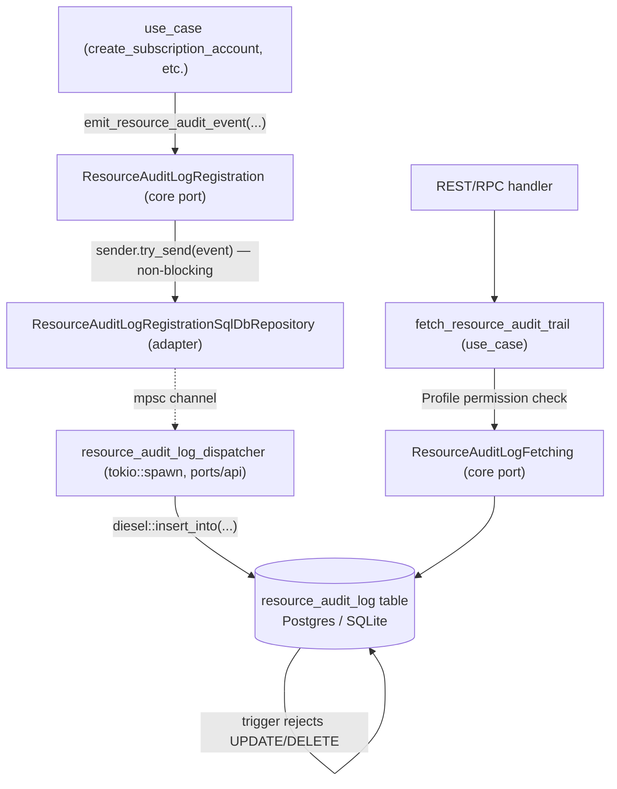

# Resource Audit Log Design

**Spec**: `.claude/specs/features/audit-log/spec.md`
**Status**: Draft

---

## Architecture Overview

Use cases keep calling a repository port exactly like they call every other repository today — no
new concept at the call site beyond one extra `.await`. The difference is what's behind that port:
the Postgres/SQLite implementation doesn't touch the database itself, it hands the event to an
in-memory channel and returns immediately. A single background task, spawned once at startup next
to the existing `webhook_dispatcher`/`email_dispatcher`, drains that channel and performs the
actual insert — so the request path never waits on a disk write, and insert order matches
enqueue order (single consumer, no per-event spawn).



Two independent immutability layers: (1) code never defines an `Updating`/`Deletion` port for this
resource, so nothing in the application can call one; (2) a database trigger rejects
`UPDATE`/`DELETE` regardless of who issues the SQL, closing the gap the app-role-owns-the-table
caveat would otherwise leave open.

---

## Code Reuse Analysis

### Existing Components to Leverage

| Component | Location | How to Use |
| --- | --- | --- |
| `WrittenBy` DTO | `core/src/domain/dtos/written_by.rs` | Reuse verbatim as the `performed_by` shape — it's already `{id, from: IDSource, email}` and already how `account.created_by`/`updated_by` capture "who did it." |
| `Profile` fluent filters (`with_read_access`, `on_tenant`, `with_tenant_ownership_or_error`, `get_related_account_or_error`) | `core/src/domain/dtos/profile/mod.rs` | Drive the read-permission check — no new authorization primitive, just a new call site combining existing methods. |
| `webhook_dispatcher` pattern | `ports/api/src/dispatchers/webhook_dispatcher.rs` | Structural template for `resource_audit_log_dispatcher`: `pub(crate) async fn(config, app_modules: Arc<SqlAppModule>) `, `tokio::spawn`, resolve repos via `app_modules.resolve_ref()`, never panic on a business error — `tracing::error!` and continue the loop. |
| `DieselDbPoolProvider` externally-parameterized `Component` pattern | `adapters/diesel_postgres/src/repositories/config.rs` | Template for giving `ResourceAuditLogRegistrationSqlDbRepository` a field that is NOT `#[shaku(inject)]`-resolved but supplied via `.with_component_parameters::<T>(TParameters { ... })` at `SqlAppModule::builder()` time in `main.rs` — same mechanism, new field type (`mpsc::Sender<NewResourceAuditLogEvent>` instead of a `DbPool`). |
| `telegram_identity_audit` table shape | `adapters/diesel_postgres/sql/up.sql:417-431` | Direct schema precedent: event-enum + `tenant_id`/`account_id` columns + `created_at` + composite index. `resource_audit_log` generalizes it (arbitrary resource type instead of hardcoded "account", adds `performed_by`/`metadata`, adds the immutability trigger this table never got). |
| `account.tenant_id` column | `adapters/diesel_postgres/src/schema.rs:21` | Already a plain nullable column on `account` — no need to parse the `account_type` JSONB to find the tenant; every account write use case already has this value on the row it just wrote. |
| `DbPoolProvider::get_pool()` | `adapters/diesel_postgres/src/models/config.rs:43` | The dispatcher resolves `&dyn DbPoolProvider` via `app_modules.resolve_ref()` and calls `.get_pool().get()` (r2d2) to obtain a connection for the insert — identical to what every existing repository does inside its own trait method. |

### Integration Points

| System | Integration Method |
| --- | --- |
| Diesel/Postgres schema | New migration file under `adapters/diesel_postgres/sql/migrations/`, plus regenerated `schema.rs` (Diesel CLI), following the existing incremental-migration convention (`20260421_01_envelope_encryption.sql`, `20260713_01_instance_settings.sql`). |
| Diesel/SQLite schema | Equivalent migration under `adapters/diesel_sqlite/`, since `active_backend_modules.rs` cfg-gates `myc_diesel_sqlite::repositories::SqlAppModule` for the `standalone` feature — skipping this breaks that build. |
| Shaku DI | New port traits registered as two more entries in each backend's `module! { components = [...] }` list (`adapters/diesel_postgres/src/repositories/mod.rs`, `adapters/diesel_sqlite/src/repositories/mod.rs`). |
| `main.rs` startup | One `mpsc::channel(...)` created before `SqlAppModule::builder()`; `tx` fed into `.with_component_parameters`; `rx` handed to the new dispatcher call alongside the existing `webhook_dispatcher(...)` line. |
| REST/RPC | One new read endpoint under `role_scoped` (mirrors an existing `fetching`-style handler); exact route path decided in Tasks once the surrounding router module for the chosen resource is inspected. |

---

## Components

### `resource_audit_log` DTOs (core)

- **Purpose**: Typed representation of an audit row and of the not-yet-persisted event a use case emits.
- **Location**: `core/src/domain/dtos/resource_audit_log/` — one file per concept (screaming-architecture rule 1):
  - `resource_audit_resource_type.rs` — `enum ResourceAuditResourceType { Account, AccountMeta, User, Tenant, TenantMeta, GuestRole, Webhook }`
  - `resource_audit_event_kind.rs` — `enum ResourceAuditEventKind { Created, Updated, Deleted }`
  - `resource_audit_log.rs` — `struct ResourceAuditLog { id: Uuid, resource_type: ResourceAuditResourceType, resource_id: Uuid, tenant_id: Option<Uuid>, event: ResourceAuditEventKind, performed_by: WrittenBy, metadata: serde_json::Value, created_at: DateTime<Utc> }` — the persisted shape.
  - `new_resource_audit_log_event.rs` — same fields minus `id`; what a use case builds and passes to the port.
- **Dependencies**: `WrittenBy` (existing), `serde_json`, `chrono`, `uuid` (already core dependencies elsewhere in the DTO layer).
- **Reuses**: `WrittenBy` as-is.

### `ResourceAuditLogRegistration` / `ResourceAuditLogFetching` (core ports)

- **Purpose**: The only two traits for this resource — deliberately no `Updating`/`Deletion`, enforcing immutability at the type level.
- **Location**: `core/src/domain/entities/resource_audit_log/resource_audit_log_registration.rs`, `resource_audit_log_fetching.rs`.
- **Interfaces**:
  - `async fn create(&self, event: NewResourceAuditLogEvent) -> Result<(), MappedErrors>` — enqueue; per the spec's edge cases, implementations must swallow backpressure/closed-channel failures into a traced warning and still return `Ok(())`, since audit logging must never fail the caller's real operation.
  - `async fn list_by_resource(&self, resource_type: ResourceAuditResourceType, resource_id: Uuid) -> Result<FetchManyResponseKind<ResourceAuditLog>, MappedErrors>` — the dominant query.
  - `async fn list_by_tenant(&self, tenant_id: Uuid, page_size: i32, skip: i32) -> Result<FetchManyResponseKind<ResourceAuditLog>, MappedErrors>` — the tenant-wide view.
- **Dependencies**: None beyond `mycelium-base` (`MappedErrors`, `FetchManyResponseKind`) — matches every existing port.
- **Reuses**: `FetchManyResponseKind` (existing response-kind pattern).

### `emit_resource_audit_event` (shared use-case helper)

- **Purpose**: One greppable call site so all ~24 instrumentation sites stay uniform and none of
  them hand-roll `NewResourceAuditLogEvent` construction, timestamp capture, or error swallowing.
- **Location**: `core/src/use_cases/shared/audit/emit_resource_audit_event.rs`.
- **Interfaces**:
  - `async fn emit_resource_audit_event(audit_repo: Box<&dyn ResourceAuditLogRegistration>, resource_type: ResourceAuditResourceType, resource_id: Uuid, tenant_id: Option<Uuid>, event: ResourceAuditEventKind, performed_by: WrittenBy, metadata: serde_json::Value) -> ()` — no `Result` return: callers fire it and move on; the function itself calls `tracing::warn!` on any `Err` from the port instead of bubbling it up, so a call site can never accidentally propagate an audit failure into its own `Result<_, MappedErrors>`.
- **Dependencies**: `ResourceAuditLogRegistration` port, `Utc::now()` for the synchronous timestamp (captured here, not at insert time — insert happens later and out of order relative to other events).
- **Reuses**: Nothing new; this is the DRY wrapper the design leans on instead of a decorator/macro.

### `ResourceAuditLogRegistrationSqlDbRepository` (adapter, one per backend)

- **Purpose**: Non-blocking enqueue into the channel; does no I/O itself.
- **Location**: `adapters/diesel_postgres/src/repositories/resource_audit_log/resource_audit_log_registration.rs` and the SQLite equivalent under `adapters/diesel_sqlite/src/repositories/resource_audit_log/`.
- **Interfaces**: implements `ResourceAuditLogRegistration::create`.
- **Dependencies**: `sender: mpsc::Sender<NewResourceAuditLogEvent>` — a plain (non-`#[shaku(inject)]`) field, supplied via `.with_component_parameters::<ResourceAuditLogRegistrationSqlDbRepository>(...)` at `SqlAppModule::builder()` time, exactly like `DieselDbPoolProvider { pool }` today.
- **Reuses**: `DieselDbPoolProvider`'s externally-parameterized `Component` pattern (no `#[shaku(inject)]`).
- **Body**: `match self.sender.try_send(event) { Ok(_) => {}, Err(TrySendError::Full(e)) => tracing::warn!(resource_type = ?e.resource_type, resource_id = %e.resource_id, "audit log channel full, dropping event"), Err(TrySendError::Closed(_)) => tracing::error!("audit log channel closed, dropping event") }; Ok(())` — always `Ok(())`.

### `resource_audit_log_dispatcher` (ports/api, background task)

- **Purpose**: The single consumer; owns the DB write.
- **Location**: `ports/api/src/dispatchers/resource_audit_log_dispatcher.rs`.
- **Interfaces**: `pub(crate) async fn resource_audit_log_dispatcher(app_modules: Arc<SqlAppModule>, mut receiver: mpsc::Receiver<NewResourceAuditLogEvent>)`.
- **Dependencies**: `Arc<SqlAppModule>` (cloned exactly like the `webhook_dispatcher(config, sql_module.clone())` call site), the owned `Receiver` half of the channel created in `main.rs`.
- **Reuses**: `webhook_dispatcher`'s structural pattern — `tokio::spawn(async move { while let Some(event) = receiver.recv().await { ... } })`, resolve `&dyn DbPoolProvider` via `app_modules.resolve_ref()`, `.get_pool().get()` for a connection, run the Diesel insert **synchronously inline** (no `spawn_blocking`) — matching how every other repository in this codebase already runs its blocking Diesel call inside an `async fn` without `spawn_blocking`. Introducing `spawn_blocking` here would be a new, inconsistent pattern for this one feature; staying consistent with the rest of the codebase is the deliberate choice (see Tech Decisions). On insert error: `tracing::error!` and `continue` — one failed row must never stop the loop, same as the webhook loop's per-item error handling.

### `fetch_resource_audit_trail` (use case, read side)

- **Purpose**: Apply the permission rule, then call the fetching port.
- **Location**: `core/src/use_cases/shared/audit/fetch_resource_audit_trail.rs` (shared, not role-scoped, because the same function serves staff/manager/owner — the permission branching happens inside it, not via separate role-scoped copies).
- **Interfaces**: `async fn fetch_resource_audit_trail(profile: Profile, resource_type: ResourceAuditResourceType, resource_id: Uuid, tenant_id: Option<Uuid>, resource_owner_account_id: Option<Uuid>, fetching_repo: Box<&dyn ResourceAuditLogFetching>) -> Result<FetchManyResponseKind<ResourceAuditLog>, MappedErrors>`.
- **Permission rule** (confirmed with the user): staff → always allowed. Else if `tenant_id.is_some()` → `profile.with_tenant_ownership_or_error(tenant_id)` OR `profile.is_manager` scoped to that tenant (exact manager-scoping call confirmed against `Profile`'s tenant methods during implementation, not fabricated here) → allowed. Else (personal resource) → `profile.on_account(resource_owner_account_id).with_read_access().get_related_account_or_error()` succeeds → allowed. Otherwise → `use_case_err("insufficient privileges to read this audit trail")`.
- **Dependencies**: `Profile`, `ResourceAuditLogFetching`.
- **Reuses**: The exact fluent-filter methods the codebase already uses for every other tenant/account permission check — no new authorization primitive.

---

## Data Models

### `resource_audit_log` table (both backends; SQLite syntax differs, semantics identical)

```sql
CREATE TABLE IF NOT EXISTS resource_audit_log (
    id            UUID        PRIMARY KEY DEFAULT gen_random_uuid(),
    resource_type TEXT        NOT NULL CHECK (resource_type IN
                       ('account', 'account_meta', 'user', 'tenant', 'tenant_meta', 'guest_role', 'webhook')),
    resource_id   UUID        NOT NULL,
    tenant_id     UUID,
    event         TEXT        NOT NULL CHECK (event IN ('created', 'updated', 'deleted')),
    performed_by  JSONB       NOT NULL,
    metadata      JSONB       NOT NULL DEFAULT '{}'::jsonb,
    created_at    TIMESTAMPTZ NOT NULL
);

CREATE INDEX idx_resource_audit_log_resource ON resource_audit_log (resource_id, created_at DESC);
CREATE INDEX idx_resource_audit_log_tenant   ON resource_audit_log (tenant_id, created_at DESC)
    WHERE tenant_id IS NOT NULL;

CREATE OR REPLACE FUNCTION prevent_resource_audit_log_mutation() RETURNS TRIGGER AS $$
BEGIN
    RAISE EXCEPTION 'resource_audit_log is immutable: % not allowed', TG_OP;
END;
$$ LANGUAGE plpgsql;

CREATE TRIGGER trg_resource_audit_log_immutable
BEFORE UPDATE OR DELETE ON resource_audit_log
FOR EACH ROW EXECUTE FUNCTION prevent_resource_audit_log_mutation();
```

`created_at` has no `DEFAULT now()` — it is always supplied by the application (captured
synchronously in `emit_resource_audit_event` at the moment the triggering use case succeeded), not
derived from insert time, so ordering and timestamps stay correct despite the async write path.

No foreign keys on `resource_id`/`tenant_id`: the row must outlive the resource it describes (a
deleted account keeps its audit history), so referential integrity is deliberately not enforced
here — same posture as `telegram_identity_audit`.

SQLite equivalent swaps `gen_random_uuid()`/`JSONB`/`TIMESTAMPTZ` for that backend's existing
conventions (checked against how `adapters/diesel_sqlite`'s other tables already represent `Uuid`/
`Jsonb`/timestamps — verify against an existing SQLite migration rather than assuming Postgres
syntax translates 1:1) and uses two triggers (`BEFORE UPDATE`, `BEFORE DELETE`, each
`RAISE(ABORT, 'resource_audit_log is immutable')`) since SQLite trigger syntax doesn't support a
combined `UPDATE OR DELETE` clause.

**Dominant query** (`list_by_resource`): `WHERE resource_id = $1 ORDER BY created_at DESC` — served
directly by `idx_resource_audit_log_resource`. `resource_type` is not part of that index because
`resource_id` alone (a UUID) already narrows to the right rows; leading the index with
`resource_type` would only help a query that scans a whole resource type, which isn't the requested
access pattern.

**Secondary query** (`list_by_tenant`): `WHERE tenant_id = $1 ORDER BY created_at DESC` — served by
`idx_resource_audit_log_tenant`.

---

## Error Handling Strategy

| Error Scenario | Handling | User Impact |
| --- | --- | --- |
| Channel full (consumer backlog) | `try_send` returns `Full`; adapter logs a warning and returns `Ok(())` | None — the triggering operation succeeds normally; that one audit event is lost |
| Channel closed (dispatcher task panicked/exited) | `try_send` returns `Closed`; adapter logs an error and returns `Ok(())` | None on the write path; audit trail silently stops growing until restart — acceptable per "must never affect performance," but worth a follow-up alert (out of scope here) |
| DB insert fails inside the dispatcher | `tracing::error!`, loop continues | None — no caller is waiting on this insert |
| Read requester lacks standing | `use_case_err("insufficient privileges...")` mapped to the same HTTP/RPC error shape every other permission failure uses | Same 403-style error UX as existing role checks |
| Direct SQL `UPDATE`/`DELETE` against the table | Trigger raises, transaction aborts | N/A — not an application-facing path |

---

## Tech Decisions (only non-obvious ones)

| Decision | Choice | Rationale |
| --- | --- | --- |
| Where fire-and-forget happens | In the adapter's `create()` (channel send), not in the use case | Keeps every use-case call site identical to how it already calls any other repository — one `.await`, no tokio/channel awareness leaking into `core/` |
| Channel type | Bounded `tokio::sync::mpsc::channel` (not `unbounded`) | Bounded is the deliberate backpressure valve — an unbounded channel could grow without limit during a burst and turn a "fire and forget" feature into a memory leak |
| Consumer concurrency | Single consumer task, no `spawn_blocking` per insert | Preserves insertion order; matches this codebase's existing convention of running blocking Diesel calls inline inside `async fn` everywhere else — introducing `spawn_blocking` here would be a new, inconsistent pattern solely for this feature |
| `resource_type` granularity | 7 coarse types (`account`, `account_meta`, `user`, `tenant`, `tenant_meta`, `guest_role`, `webhook`), not one type per use case | "Subscription account" etc. are all just `account` rows; finer-grained detail (which use case fired) goes in `metadata.action`, not in a wider enum |
| `event` granularity | 3 values (`created`/`updated`/`deleted`) | Status/privilege changes are modeled as `updated` + `metadata` describing what changed, avoiding an ever-growing event enum |
| Immutability enforcement | Both no `Updating`/`Deletion` port AND a DB trigger | The code-level omission is bypassable by anyone with direct DB access (and the app's DB role likely owns the table, so `REVOKE` alone would be illusory); the trigger closes that gap independent of who's connecting |
| Read authorization | A single shared use case with branching logic, not one use case per role | Mirrors `Profile::get_related_account_or_error`'s own internal staff/manager/account branching — the codebase's established shape for "one function, multiple standings," not `role_scoped/{staff,manager,beginner}` duplication |

---

## Open Items to Verify During Tasks (not assumed here)

- Exact `Profile` method for "is this profile a manager of tenant X" scoped correctly (vs. the
  global `is_manager` flag) — confirm against `profile/mod.rs` before writing the permission
  branch.
- SQLite equivalents for `gen_random_uuid()`, `JSONB`, `TIMESTAMPTZ`, and trigger syntax — confirm
  against an existing `adapters/diesel_sqlite` migration, don't assume Postgres syntax ports as-is.
- Exact REST/RPC router module and path convention for the new read endpoint — confirm against a
  same-shape existing `fetching` handler once the resource's router module is opened.
