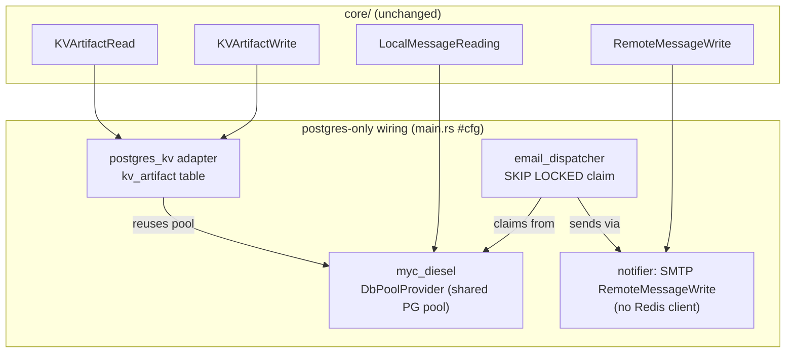

# Postgres-Only Mode — Design

**Spec:** `./spec.md`
**Context:** `./context.md`
**Status:** Draft
**Created:** 2026-07-22

Guiding invariant (from standalone): **`core/` and use-cases do not change; mode selection is a
compile-time feature at the DI wiring layer only.** Full mode stays the Cargo `default` build and
the published image. The **one** deliberate exception is the shared `email_dispatcher` claim fix
(DEC-8 / POM-13/20).

---

## 1. Architecture Overview

Three compile-time modes select adapter implementations behind the same `core` port traits:

```
                       core/  (domain + use_cases + port traits)          ← UNCHANGED
                                 ▲              ▲              ▲
        ┌────────────────────────┘              │              └────────────────────────┐
   full (default)                          postgres-only (NEW)                     standalone
 ┌──────────────────────┐             ┌──────────────────────────┐          ┌────────────────────────┐
 │ diesel  (Postgres)   │ persistence │ diesel  (Postgres)        │  persist │ diesel_sqlite (SQLite) │
 │ kv_db   (Redis SETEX)│ KV cache    │ postgres_kv (kv_artifact) │  KV      │ moka_cache (in-proc)   │
 │ notifier(SMTP; +dead │ email       │ notifier (SMTP only)      │  email   │ notifier (stub/file)   │
 │          Redis LPUSH)│             │                           │          │                        │
 └──────────────────────┘             └──────────────────────────┘          └────────────────────────┘
        │  email queue = message_queue table + email_dispatcher  │            single-instance poller
        └────────────── shared; now claims via SKIP LOCKED ──────┘
              ▲                                                   ▲
              └────────── ports/api  (main.rs wires via #[cfg]) ──┘
```

Full and postgres-only **share** the Postgres persistence layer (`myc_diesel`) and the
`message_queue`/dispatcher email path; they diverge **only** at the KV adapter (Redis vs Postgres)
and the notifier module (with vs without a Redis client). Standalone is orthogonal (different Diesel
backend).



---

## 2. Code Reuse Analysis

### Existing components to leverage

| Component | Location | How to use |
|---|---|---|
| `DbPoolProvider` (shared PG pool) | `adapters/diesel_postgres/src/models/config.rs:42` | `postgres_kv` **injects** `Arc<dyn DbPoolProvider>` → reuses the same `Pool<ConnectionManager<PgConnection>>`, no second pool. |
| `moka_cache` adapter shape | `adapters/moka_cache/src/{config.rs,repositories/*}` | Template for `postgres_kv`: a provider component + two repo components + a `KVAppModule`. |
| KV port traits | `core/src/domain/entities/kv_artifact/*` | Implement `KVArtifactRead`/`KVArtifactWrite` unchanged. |
| `message_queue` table + `email_dispatcher` | `adapters/diesel_postgres/sql/up.sql:248`, `ports/api/src/dispatchers/email_dispatcher.rs`, `adapters/notifier/src/executor/mod.rs` | Reuse as-is; only the SQL `list_oldest_messages` claim query changes. |
| SMTP `RemoteMessageSendingRepository` | `adapters/notifier/src/repositories/remote_message_sending.rs` | Already Redis-free; expose it in a Redis-free notifier module. |
| `active_backend_modules.rs` indirection | `ports/api/src/models/active_backend_modules.rs` | Add `postgres-only` cfg arms; ~50 handlers stay untouched. |
| Postgres migration convention | `adapters/diesel_postgres/sql/migrations/YYYYMMDD_NN_*.sql` | Add `kv_artifact` table + `message_queue` claim index as new migration files. |

### Integration points

| System | Integration |
|---|---|
| DI (`shaku`) | `postgres_kv::repositories::KVAppModule` drops into the existing `KVAppModule` slot. |
| Postgres DB | New `kv_artifact` table; new index on `message_queue(status, created)`; both in the same DB the diesel pool already targets. |
| Config | `config_handler.rs` cfg-gates the `[redis]` field out of the `postgres-only` build. |

---

## 3. Components

### 3.1 `postgres_kv` cache adapter (new crate) — POM-3..8

- **Purpose:** Postgres-backed `KVArtifactRead`/`KVArtifactWrite` with per-key TTL + expiry sweep.
- **Location:** `adapters/postgres_kv/` — crate `mycelium-postgres-kv`, lib `myc_postgres_kv`
  (registered in root `Cargo.toml` `[workspace.dependencies]` and as an optional dep in
  `ports/api/Cargo.toml`). Sibling crate per the adapter-separation rule (DEC-5).
- **Dependencies:** `myc-core`, `mycelium-base`, `mycelium-diesel` (for `DbPoolProvider` + reuse of
  the pool), `diesel`, `shaku`, `async-trait`, `tokio`, `tracing`.
- **Interfaces (impl of core traits):**
  - `KVArtifactWrite::set_encoded_artifact(key, value, ttl) -> CreateResponseKind<String>` —
    `INSERT INTO kv_artifact (key, value, expires_at) VALUES ($1,$2, now() + ($3 sec)) ON CONFLICT (key) DO UPDATE SET value=EXCLUDED.value, expires_at=EXCLUDED.expires_at`.
  - `KVArtifactRead::get_encoded_artifact(key) -> FetchResponseKind<String,String>` —
    `SELECT value FROM kv_artifact WHERE key=$1 AND expires_at > now()`; row → `Found(value)`, else
    `NotFound(Some(key))` (lazy expiry, POM-5).
- **Sweeper (POM-6):** the provider self-spawns a `tokio` interval task on construction running
  `DELETE FROM kv_artifact WHERE expires_at <= now()`; interval configurable, sane default (e.g.
  60s). Lazy expiry on read is the correctness source of truth; the sweep only reclaims space, so a
  missed sweep is harmless.
- **Schema ownership:** declare the `kv_artifact` `diesel::table!` **locally** in the crate
  (self-contained), while the DDL migration lives in the shared Postgres migrations dir (§5).
- **Reuses:** `moka_cache` structure; `DbPoolProvider` for the connection.

### 3.2 Multi-pod-safe claim in the Postgres message repo — POM-9..13, DEC-8

- **Purpose:** stop two pods from delivering the same email; reuse `message_queue` + dispatcher.
- **Location:** `adapters/diesel_postgres/src/repositories/.../local_message_read.rs`
  (`LocalMessageReadingSqlDbRepository::list_oldest_messages`). **Port signature unchanged**
  (POM-18) — only the query body changes.
- **Claim query (atomic):**
  ```sql
  UPDATE message_queue SET attempted = now()
  WHERE id IN (
    SELECT id FROM message_queue
    WHERE status = 'Queued'                             -- verified: write persists Display = "Queued"
      AND (attempted IS NULL OR attempted < now() - ($visibility || ' seconds')::interval)
    ORDER BY created DESC                                -- PRESERVE existing full-mode order (see below)
    LIMIT $tail_size
    FOR UPDATE SKIP LOCKED
  )
  RETURNING id, message, created, attempted, status, attempts, error;
  ```
  Each pod atomically claims a disjoint set (`SKIP LOCKED`); the `attempted` stamp removes claimed
  rows from **other pods'** (and its own) next selection window for the **visibility timeout**, so a
  crashed pod's row becomes re-claimable (POM-11) without a new status.
- **⚠ SAFETY INVARIANT (must hold or double-send returns):** `visibility_timeout` MUST exceed the
  **worst-case processing time of a whole claimed batch** — `attempted` is stamped on all
  `tail_size` rows up front, but they are sent sequentially, so a *still-alive but slow* pod whose
  batch outlasts the timeout would have its un-sent rows re-claimed by another pod. Therefore:
  `visibility_timeout  >  tail_size × max_single_SMTP_send + margin`. **This drives two defaults:**
  keep `tail_size` **small** (the current hard-coded `25` in `executor::consume_messages` should
  drop to a modest configurable value, e.g. 10) and set a **conservative default**
  `visibilityTimeoutSecs` (e.g. 300) that comfortably satisfies the inequality for the default batch
  and SMTP timeout. Operators raising batch size MUST raise the timeout. A smaller batch bounds the
  window far more reliably than a big batch with a long timeout.
- **Interaction with the existing in-invocation retry** (verified in `executor/mod.rs:39-125`):
  `consume_messages` re-queries `list_oldest_messages` each loop pass (cap `max_retries=3`). Since a
  claim stamps `attempted=now()`, just-claimed/just-failed rows are **excluded** from the immediate
  re-query — so the in-invocation "retry now" for failed messages is **superseded** by
  visibility-timeout re-claim on a later tick. Net effect: a transiently-failed message retries
  after ≈ one visibility window instead of within the same invocation. Acceptable (retry latency,
  not loss). An empty claim returns `Found([])`; the loop then terminates via the retries cap. This
  behavior change to the shared executor is part of DEC-8 and must be called out in POM-20.
- **Why not a `Processing` status:** adding a `MessageStatus::Processing` variant is a `core` DTO
  change (violates POM-18). Reusing the existing `attempted` column + a visibility timeout achieves
  claim/re-claim with **zero core changes**. (TD-3.)
- **Ordering preserved:** the current impl uses `created DESC` (`local_message_read.rs:45`) — the
  claim query keeps `DESC` so full-mode ordering is unchanged. (Switching to FIFO/`ASC` would be a
  separate behavior change, explicitly **out of scope** here.)
- **Screaming-architecture deviation (conscious):** `LocalMessageReading::list_oldest_messages` now
  issues an `UPDATE … RETURNING` — a read-named port that mutates. Accepted trade to avoid a `core`
  signature/`MessageStatus` change (POM-18); recorded here rather than left silent.
- **Applies to:** the Postgres diesel adapter → **full and postgres-only** both get the fix (DEC-8).
  The SQLite adapter (standalone) keeps its plain `created DESC` select — single-instance, no
  double-send risk, no `SKIP LOCKED` support — so standalone is untouched.
- **Requires:** an index `message_queue(status, created)` (§5) — none exists today.

### 3.3 Redis-free notifier module — POM-12

- **Purpose:** provide SMTP `RemoteMessageWrite` to the dispatcher without constructing a Redis
  client.
- **Approach:** add a cfg-gated notifier module assembly (working name
  `PostgresNotifierAppModule`) that registers the SMTP `RemoteMessageSendingRepository` +
  `SmtpClient` only — no `SharedClientImpl` (Redis), no dead `LocalMessageSendingRepository` LPUSH
  binding. `LocalMessageWrite`/`LocalMessageReading` continue to resolve from the **SQL** module (as
  in full mode). Full mode's `NotifierAppModule` is left as-is.
- **Location:** `adapters/notifier/` (new module assembly, behind the notifier crate's feature set).

### 3.4 DI wiring — POM-18/19

- `active_backend_modules.rs`:
  ```rust
  #[cfg(any(feature = "full", feature = "postgres-only"))]
  pub use myc_diesel::repositories::SqlAppModule;
  #[cfg(feature = "standalone")]
  pub use myc_diesel_sqlite::repositories::SqlAppModule;

  #[cfg(feature = "full")]
  pub use myc_kv::repositories::KVAppModule;
  #[cfg(feature = "postgres-only")]
  pub use myc_postgres_kv::repositories::KVAppModule;
  #[cfg(feature = "standalone")]
  pub use myc_moka_cache::repositories::KVAppModule;
  ```
- `main.rs`: add a third `#[cfg(feature = "postgres-only")] async fn initialize_modules`. Returns a
  tuple like full **minus `SharedAppModule`** (no Redis): builds `SqlAppModule` (PG, as full),
  `KVAppModule` from `postgres_kv` (seeded with the `DbPoolProvider`), `PostgresNotifierAppModule`
  (SMTP), `MemDbAppModule` (unchanged), audit-log receiver. Also update: the call-site destructure
  (`main.rs:317-360`, arity), the `app_data` registration block (`main.rs:561-571`), and the
  dispatcher spawn (`main.rs:412-433`, binds `LocalMessageReading`/`LocalMessageWrite` from the SQL
  module — unchanged shape, now backed by the claiming query).
- **Mutual-exclusion guards** (extend the existing `compile_error!`s): exactly one of
  `full` / `postgres-only` / `standalone`; error on any pair and on none.

### 3.5 Config surface — POM-14..17

`config_handler.rs`: widen the Postgres+SMTP field gates from `#[cfg(feature = "full")]`
to `#[cfg(any(feature = "full", feature = "postgres-only"))]` (diesel, smtp, api, auth,
account-life-cycle, vault). Keep the **`redis`** field gated to `full` **only** → a
`postgres-only` build never parses/needs `[redis]` (POM-14). `[queue]` stays loaded in all modes
(backend-neutral) and gains two optional, defaulted fields for the claim: `visibilityTimeoutSecs`
(default 300 — see the §3.2 safety invariant) and a modest claim batch size (default ≈10, replacing
the hard-coded `25`). Ship `settings/config.postgres-only.example.toml` (Postgres + SMTP, no
`[redis]`).

---

## 4. Data Models

### 4.1 New table `kv_artifact` (postgres-only cache)

```sql
CREATE TABLE kv_artifact (
    key        TEXT        PRIMARY KEY,
    value      TEXT        NOT NULL,
    expires_at TIMESTAMPTZ NOT NULL
);
CREATE INDEX idx_kv_artifact_expires_at ON kv_artifact (expires_at);  -- sweeper
```
- Unused/empty in full mode (harmless); the source of KV in postgres-only.
- `value` is `TEXT` (base64/JSON, same as Redis stored today); document practical size.

### 4.2 New index on existing `message_queue` (shared claim)

```sql
CREATE INDEX idx_message_queue_claim ON message_queue (status, created);
```
No column changes — `attempted` (existing) is the claim/visibility marker.

---

## 5. Migrations (POM-7)

Add two files under `adapters/diesel_postgres/sql/migrations/` (convention `YYYYMMDD_NN_<name>.sql`):
1. `<date>_01_kv_artifact_cache.sql` — the `kv_artifact` table + index.
2. `<date>_02_message_queue_claim_index.sql` — the `message_queue(status, created)` index.

Also fold both into `adapters/diesel_postgres/sql/up.sql` (fresh-install path) and add the matching
`diesel::table!` block for `kv_artifact` (locally in `postgres_kv`, or in `schema.rs`). Postgres
migrations are operator-applied via `psql` (documented in the example config + README note). No
SQLite mirror is needed (standalone uses moka, not `kv_artifact`, and keeps its plain dispatcher).

---

## 6. Feature graph (DEC-6) — `ports/api/Cargo.toml`

```toml
[features]
default = ["full"]                                          # full — UNCHANGED, still default

# Full mode (Postgres + Redis + SMTP) — UNCHANGED.
full = ["dep:mycelium-diesel", "dep:mycelium-key-value"]

# NEW: Postgres-only (Postgres persistence + Postgres KV cache + SMTP, no Redis). Multi-pod.
# Build with `--no-default-features --features postgres-only`.
postgres-only = ["dep:mycelium-diesel", "dep:mycelium-postgres-kv" /*, notifier smtp-only feature */]

# Standalone (SQLite + moka + stub/file email) — UNCHANGED.
standalone = ["dep:mycelium-diesel-sqlite", "dep:mycelium-moka-cache",
              "mycelium-notifier/local-transport", "mycelium-config/standalone-secrets"]

rhai = ["dep:rhai"]
```
Exactly one of the three backend features may be active (compile-time guarded). Naming note: the
new feature is `postgres-only` — it and `full` both use Postgres persistence; the
distinguishing factor is "no Redis". (Alt names considered: `no-redis`, `pg-native`; `postgres-only`
chosen for product clarity — TD-4.)

---

## 7. Error Handling

| Scenario | Handling | Impact |
|---|---|---|
| Concurrent `set` same key | `ON CONFLICT DO UPDATE` (last-write-wins) | none |
| Read expired-not-swept row | `expires_at > now()` filter → `NotFound` | cache miss, self-heals |
| Sweeper misses/fails a cycle | lazy expiry on read still correct; next cycle reclaims | none (space only) |
| Two pods claim simultaneously | `FOR UPDATE SKIP LOCKED` → disjoint claims | exactly-once claim |
| Pod dies mid-send | `attempted` ages past visibility timeout → re-claimed | at-least-once delivery (document: crash between SMTP-accept and row-DELETE can re-send) |
| Live pod's batch outlasts the timeout | **prevented by the §3.2 invariant** (small batch + generous timeout); if violated → double-send | must hold: `timeout > batch × max_send + margin` |
| Transient send failure | superseded in-invocation retry → re-claimed on a later tick after the visibility window | retry latency ≈ one window (not loss) |
| `[redis]` present in postgres-only | field cfg'd out → ignored, not parsed | no error (POM-15) |
| Illegal feature combo | `compile_error!` | build fails fast |

All adapter errors use `MappedErrors` factories (`creation_err`/`fetching_err`/…); no `unwrap` in
prod code (project rules).

---

## 8. Tech Decisions

| ID | Decision | Rationale |
|---|---|---|
| TD-1 | `postgres_kv` reuses `DbPoolProvider` (no own pool) | one connection pool; consistent tuning; less config. |
| TD-2 | Sweeper self-spawned inside the adapter provider | keeps the periodic job out of `core` and out of `ports/api`; adapter owns its lifecycle. |
| TD-3 | Claim via `attempted` + visibility timeout, **not** a new `Processing` status | avoids a `core` `MessageStatus` change (POM-18); reuses existing columns. |
| TD-4 | Feature name `postgres-only`; keep `full` = full, unchanged | minimal churn (standalone's cfg gates already reference `full`); full stays default. |
| TD-5 | Packaging: parametrize the Dockerfile build features via a build-arg defaulting to full | default published image stays byte-identical full; `--build-arg` produces the postgres-only image (POM-21) without a second Dockerfile. |

---

## 9. Packaging (POM-21)

Parametrize `Dockerfile` build features, default preserving current behavior:
```dockerfile
ARG CARGO_FEATURES="full,rhai"     # default = full, image unchanged
RUN cargo install mycelium-api --no-default-features --features "${CARGO_FEATURES}" --version "${VERSION}"
```
Postgres-only image: `docker build --build-arg CARGO_FEATURES=postgres-only,rhai …`. The default
build (and `docker-release.yml`) is unaffected. Whether CI publishes a separate `-postgres-only`
tag is deferred to Tasks; the minimum deliverable is the documented, reproducible build.

**Caveat:** `cargo install` from crates.io works only **after** `mycelium-postgres-kv` and the new
`mycelium-api` feature are published. The **first** image build for this feature is pre-publish, so
it needs a **source build** (like `Dockerfile.standalone`) — `cargo build --no-default-features
--features postgres-only,rhai`. Switch to the `cargo install` path once the crates are released.

---

## 10. Component breakdown (for the Tasks phase — not atomic yet)

1. **Feature scaffolding** — add `postgres-only` feature + `mycelium-postgres-kv` optional dep;
   extend mutual-exclusion `compile_error!`s; `active_backend_modules.rs` cfg arms. No behavior yet.
2. **`postgres_kv` adapter crate** — provider (reuse `DbPoolProvider`), two KV repo impls, local
   `kv_artifact` `table!`, sweeper task, `KVAppModule`, round-trip + TTL tests.
3. **Migrations** — `kv_artifact` table + index; `message_queue(status, created)` index; fold into
   `up.sql`.
4. **Shared claim fix** — rewrite `LocalMessageReadingSqlDbRepository::list_oldest_messages` (PG) to
   the `SKIP LOCKED` claiming query; visibility-timeout config; concurrency test (two claimers →
   disjoint sets). SQLite impl untouched.
5. **Redis-free notifier module** — `PostgresNotifierAppModule` (SMTP only).
6. **Config + wiring** — widen cfg gates in `config_handler.rs`; third `initialize_modules`;
   call-site/app_data/dispatcher-spawn cfg arms; example config.
7. **Packaging** — Dockerfile `CARGO_FEATURES` build-arg; docs (build command, migration apply,
   no `[redis]`).
8. **Verification** — `cargo build`/`test`/`fmt` green for all three modes; two-pod dedup demo.

---

## 11. Traceability

| Requirement | Design section |
|---|---|
| POM-1, POM-2 (PG persistence, no Redis) | §3.4, §6 |
| POM-3..8 (Postgres KV cache) | §3.1, §4.1, §5 |
| POM-9..13 (queue reuse + claim fix) | §3.2, §3.3, §4.2, §5 |
| POM-14..17 (config) | §3.5 |
| POM-18..20 (wiring / non-regression + DEC-8 exception) | §3.4, §3.2 |
| POM-21 (packaging) | §9 |
