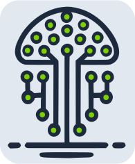
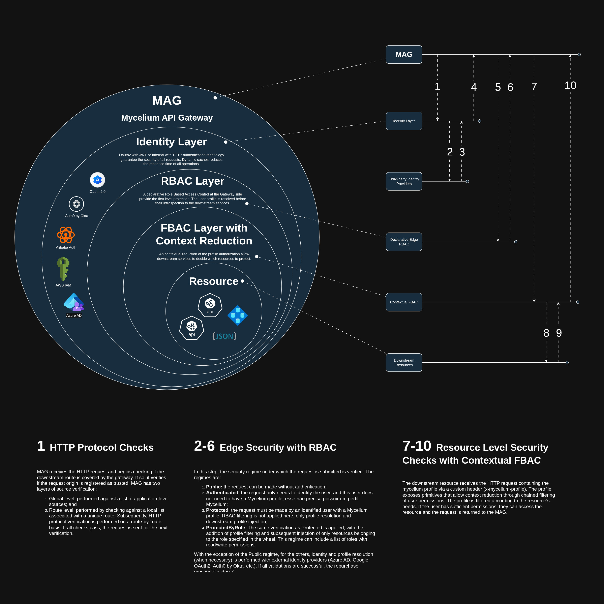

# 🚀 Mycelium: The Ultimate API Gateway



Mycelium is an **open and free API Gateway**, designed to operate in
modern, multi-tenant, and API-oriented environments. The project prioritizes
architectural clarity, security, and extensibility, maintaining an explicit
separation between technical concerns and organizational aspects of the project.

This repository documents the fundamentals of Mycelium, with special focus on its
**authorization model**, which combines declarative controls at the gateway with
contextual decisions close to the resource.

---

## Overview

Mycelium acts as the entry layer for downstream services, being responsible for
authentication, identity normalization, routing, and security policy
enforcement. The gateway does not impose business logic, but provides
**authorization primitives** that allow each service to evaluate permissions in
an explicit, secure, and contextual manner.

The project is maintained as open source software, with its continuity based on
governance, community collaboration, and ecosystem funding and acceleration
initiatives — aspects that are **independent of internal technical decisions**.

---

## Key Features

* Modern and extensible API Gateway
* Native support for multi-tenant environments
* Authorization at multiple layers (gateway and downstream)
* Identity context injection via Profile
* Composable authorization primitives
* Architecture compatible with market standards

---

## Authorization Model

Mycelium's authorization model is one of its central pillars and is documented
in detail in the file:

👉 **[Authorization](./docs/book/src/01-authorization.md)**

In summary:

* The gateway applies **declarative controls per route** (coarse-grained)
* Downstream services apply **contextual authorizations** (fine-grained)
* The Profile acts as an active capability object, not just as an identity
  payload

---

## Conceptual Structure



```
Client
  ↓
API Gateway (auth, routing, edge RBAC)
  ↓
Downstream Services (contextual FBAC)
```

This separation ensures low coupling, high expressiveness, and security
decisions close to the resource.

---

## Project Governance and Sustainability

Mycelium is an open and free project. Its maintenance and evolution are handled
within the project's organizational scope, through:

* Community collaboration
* Institutional support
* Funding and acceleration initiatives

These aspects **do not influence or condition** the technical authorization
model, which remains neutral, explicit, and verifiable.

---

## Project Status

Mycelium is under active development and open to contributions. Architectural
discussions, improvement proposals, and conceptual reviews are welcome.

---

## License

See the [LICENSE](./LICENSE) file for details about the project's licensing.
